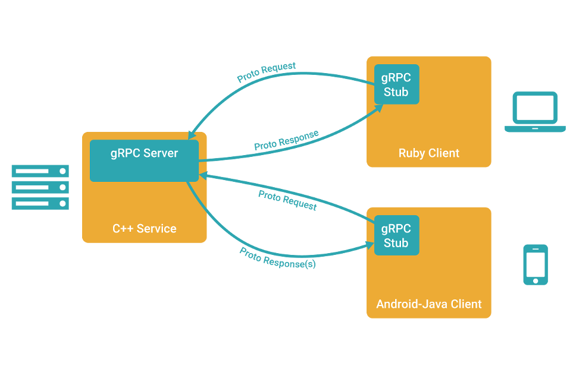

### gRPC简介

gRPC目前提供 C、Java 和 Go 语言版本，分别是 grpc, grpc-java, grpc-go

其中 C 版本支持 C, C++, Node.js, Python, Ruby, Objective-C, PHP, C#

#### gRPC服务端
定义一个服务，指定其能够被远程调用的方法（包含参数和返回类型）。在服务端实现这个接口，并运行一个 gRPC 服务器来处理客户端调用
#### gRPC客户端
在 gRPC客户端拥有一个存根能够像服务端一样的方法，客户端应用可以像调用本地对象一样直接调用另一台不同的机器上服务端应用的方法，能够更容易地创建分布式应用和服务

#### Protocol buffers简介
protocol buffer是google推出的一种数据描述语言，类似于XML能够将结构化数据序列化，可用于数据存储、通信协议等方面，在 gRPC 里使用 proto3，这样可以使用 gRPC 支持全部范围的的语言




#### 安装protobuf

- 在 github 获取 protobuf 源码，windows 系统可以直接下载 exe 文件 
    https://github.com/google/protobuf/releases

-  linux 环境使用源码进行安装的步骤  

```
# 获取源码包
wget https://github.com/google/protobuf/archive/v3.5.0.tar.gz

# 解压缩并进入源码目录
tar -zxvf v3.5.0.tar.gz
cd protobuf-3.5.0

# 生成configure文件
./autogen.sh

# 编译安装
./configure
make
make check
make install
```

#### 编写.proto

```
syntax = "proto3";
option go_package = "./pb";


// 算术运算请求结构
message ArithRequest {
    int32 a = 1;
    int32 b = 2;
}

// 算术运算响应结构
message ArithResponse {
    int32 pro = 1;  // 乘积
    int32 quo = 2;  // 商
    int32 rem = 3;  // 余数
}

// rpc方法
service ArithService {
    rpc multiply (ArithRequest) returns (ArithResponse);    // 乘法运算方法
    rpc divide (ArithRequest) returns (ArithResponse);      // 除法运算方法
}
```

 把 .proto 文件转化成 .go 文件，使用protoc工具生成代码
```
protoc --go_out=plugins=grpc:. arith.proto
```

sever、client都需要引入grpc
```
go get google.golang.org/grpc
```
#### server 端

``` golang

var (
	port = flag.Int("port", 8097, "The server port")
)

// 算术运算结构体
type Arith struct {
	pb.UnimplementedArithServiceServer
}

// 乘法运算方法
func (*Arith) Multiply(ctx context.Context, req *pb.ArithRequest) (*pb.ArithResponse, error) {
	res := new(pb.ArithResponse)
	res.Pro = req.GetA() * req.GetB()
	return res, nil
}

// 除法运算方法
func (*Arith) Divide(ctx context.Context, req *pb.ArithRequest) (*pb.ArithResponse, error) {
	res := new(pb.ArithResponse)
	if req.GetB() == 0 {
		return res, errors.New("divide by zero")
	}
	res.Quo = req.GetA() / req.GetB()
	res.Rem = req.GetA() % req.GetB()
	return res, nil
}

func main() {
	flag.Parse()
	lis, err := net.Listen("tcp", fmt.Sprintf("127.0.0.1:%d", *port))
	if err != nil {
		log.Fatalf("failed to listen: %v", err)
	}
	s := grpc.NewServer()
	pb.RegisterArithServiceServer(s, new(Arith))
	log.Printf("server listening at %v", lis.Addr())
	if err := s.Serve(lis); err != nil {
		log.Fatalf("failed to serve: %v", err)
	}
}

```


#### client 端

``` golang
const (
	defaultName = "ArithService"
)

var (
	addr = flag.String("addr", "127.0.0.1:8097", "the address to connect to")
	name = flag.String("name", defaultName, "Name to ArithService")
)

func main() {
	flag.Parse()
	// Set up a connection to the server.
	conn, err := grpc.Dial(*addr, grpc.WithInsecure())
	if err != nil {
		log.Fatalf("did not connect: %v", err)
	}
	defer conn.Close()
	c := pb.NewArithServiceClient(conn)

	// Contact the server and print out its response.
	ctx, cancel := context.WithTimeout(context.Background(), 10*time.Second)
	defer cancel()
	r, err := c.Multiply(ctx, &pb.ArithRequest{
		A: 11,
		B: 12,
	})
	if err != nil {
		log.Fatalf("could not ArithService: %v", err)
	}
	log.Printf("%s Multiply : %d", *name, r.GetPro())
}
```