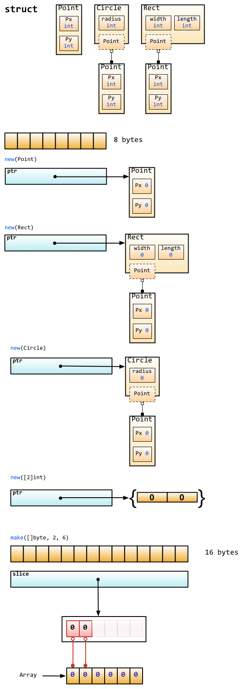

## new与make
>  new可以为所有类型分配内存，make用于slice，map，和channel的初始化  
```golang
func new(Type) *Type
func make(t Type, size ...IntegerType) Type
```

### 区别

#### 返回值

从定义中可以看出，new返回的是指向Type的指针。 make直接返回的是Type类型值。

二者内存的分配都是在堆上

#### 入参
new只有一个Type参数，Type可以是任意类型数据

make可以有多个参数，其中第一个参数与new的参数相同，但是只能是slice，map，或者chan中的一种。对于不同类型，size参数说明如下：
- 对于slice，第一个size表示长度，第二个size表示容量，且容量不能小于长度。如果省略第二个size，默认容量等于长度。
- 对于map，会根据size大小分配资源，以足够存储size个元素。如果省略size，会默认分配一个小的起始size。
- 对于chan，size表示缓冲区容量。如果省略size，channel为无缓冲channel。

#### make和new对应底层的内存分配


## 注意事项

1、指针类型初始化需要分配地址

```golang
package main
import "fmt"
func main() {
	var i *int
	*i = 10
	fmt.Println(*i)
}
```
上面代码编译不报错，运行报错：
```
panic: runtime error: invalid memory address or nil pointer dereference
```

1.1改成下面代码可正常运行
```golang
var i *int = new(int)
```

1.2、如果不想使用new，也可用如下方式

```golang
package main

import "fmt"

func main() {
	var i *int
	var j int
	i = &j
	*i = 10 // 此时j也为10
	fmt.Println(*i)
}
```

2、new函数内存置为零的好处

```golang
package main

import (
	"fmt"
	"sync"
)

func main() {
	u := new(user)
	u.lock.Lock()
	u.name = "张三"
	u.age = 18
	u.lock.Unlock()
	fmt.Println(u)
}

type user struct {
	lock sync.Mutex
	name string
	age  int
}
```
因为是指针类型初始化为零值，这里的锁可以直接使用


### 参考文献
[Go make 和 new的区别](https://www.cnblogs.com/vincenshen/p/9356974.html)
[Go语言中new与make的区别](https://zhuanlan.zhihu.com/p/92993032)