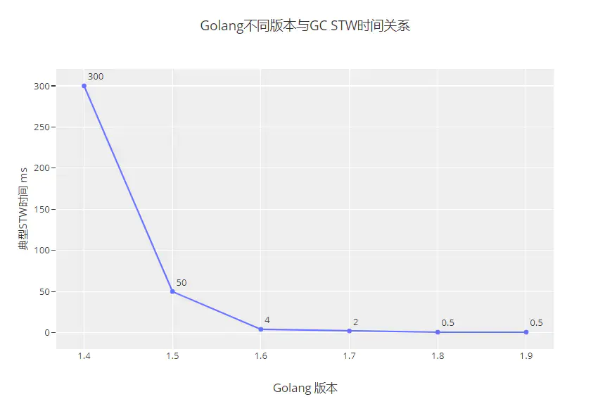
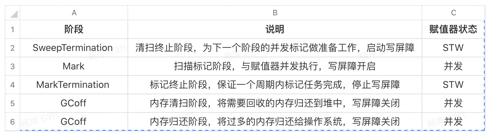

## Go V1.3之前 标记-清除(mark and sweep)法

**具体操作**
1. 暂停程序业务逻辑，找出可达对象和不可达对象
1. 开始标记，程序找出它所有可达的对象，并做上标记
1. 标记完之后，开始清除未标记的对象
1. 停止暂停，让程序继续跑。循环重复这个过程，直到程序生命周期结束

**缺点**
- STW 让程序暂停，程序出现卡顿
- 标记需要扫描整个heap
- 清除数据会产生heap碎片
- go V1.3版本 将第四步和第三步换位置，缩短STW的时间


## Go V1.5 三色标记法+屏障机制

**具体操作**
1. 只要是新创建的对象，默认的颜色都标记为“白色”
1. 每次GC回收开始，从根节点开始遍历所有对象，把遍历到的对象从白色集合放入“灰色”集合
1. 遍历灰色集合，将灰色对象引用的对象从白色集合放入灰色集合，之后将此灰色对象放入黑色集合
1. 重复第三步，直到灰色集合中无任何对象
1. 回收所有白色标记的对象，也就是回收垃圾

### 三色标记缺陷

**条件1**：一个白色对象被黑色对象引用（白色被挂在黑色下）
**条件2**：灰色对象与它之间的可达关系的白色对象遭到破坏（灰色同时丢了该白色）

`两个条件同时满足，那么就会出现对象丢失的现象`

### 三色标记缺陷解决理论

- 破坏条件1(强三色不变式)
  - 强制性的不允许黑色对象引用白色对象

- 破坏条件2(弱三色不变式)
  -  黑色对象可以引用白色对象，白色对象存在其他灰色对象对它的引用，或者可达它的链路上游存在灰色对象

### 屏障机制
> 根据三色标记缺陷解决理论，Go在V1.5引入屏障机制

**1. 插入屏障：对象被引用时触发的机制  （不在栈上使用）**
- 具体操作：在A对象引用B对象的时候，B对象被标记为灰色
- 满足：强三色不变式（不存在黑色对象引用白色对象的情况了，因为白色强制变成灰色）
- 不足：结束时需要STW来重新扫描栈，大约需要10~100ms  

**2. 删除屏障：对象被删除时触发的机制**
- 具体操作：被删除的对象，如果自身为灰色或者白色，那么被标记为灰色
- 满足：弱三色不变式。（保护灰色对象到白色对象的路径不会断）
- 不足：回收精度低， 一个对象即使被删除了最后一个指向它的指针也依旧可以活过这一轮，在下一轮GC中被清理掉

## Go V1.8 三色标记法+混合写屏障机制

**具体操作**
1. GC开始将栈上的对象全部扫描并标记可达对象为黑色（之后不再进行第二次重复扫描，无需STW）
1. GC期间，任何在栈上创建的新对象均为黑色
1. 被删除的对象标记为灰色
1. 被添加的对象标记为灰色

**满足**
变形的弱三色不变式 （结合了插入、删除写屏障两者的优点）

## GC 版本优化
1. GoV1.3- 普通标记清除法，整体过程需要启动STW，效率极低
1. GoV1.5- 三色标记法， 堆空间启动写屏障，栈空间不启动，全部扫描之后，需要重新扫描一次栈(需要STW)，效率普通
1. GoV1.8-三色标记法，混合写屏障机制， 栈空间不启动，堆空间启动。整个过程几乎不需要STW，效率较高。
1. go1.9，提升指标比较多，（1）过去 runtime.GC, debug.SetGCPercent, 和 debug.FreeOSMemory都不能触发并发GC，他们触发的GC都是阻塞的，go1.9可以了，变成了在垃圾回收之前只阻塞调用GC的goroutine。（2）debug.SetGCPercent只在有必要的情况下才会触发GC。
1. go.1.10，小优化，加速了GC，程序应当运行更快一点点。
1. go1.12，显著提高了堆内存存在大碎片情况下的sweeping性能，能够降低GC后立即分配内存的延迟。
1. go1.13，着手解决向操作系统归还内存的，提出了新的 Scavenger
1. go1.14，替代了仅存活了一个版本的 Scavenger，全新的页分配器，优化分配内存过程的速率与现有的扩展性问题，并引入了异步抢占，解决了由于密集循环导致的 STW 时间过长的问题


 

## gc阶段

- 为了打开写屏障，必须停止每个goroutine，让垃圾收集器观察并等待每个goroutine进行函数调用， 等待函数调用是为了保证goroutine停止时处于安全点。
- 一旦写屏障打开，垃圾收集器就开始标记阶段，垃圾收集器所做的第一件事是占用25%CPU。


## GC注意事项
1. 主动触发（runtime.GC()） 被动触发 （GC百分比、定时）
1. 控制内存分配的速度，限制 goroutine 的数量，从而提高赋值器对 CPU 的利用率。
1. 减少并复用内存，例如使用 sync.Pool 来复用需要频繁创建临时对象，例如提前分配足够的内存来降低多余的拷贝。
1. 需要时，增大 GOGC 的值，降低 GC 的运行频率。

**降低并复用已经申请的内存**
```golang
func newBuf() []byte {
   return make([]byte, 10<<20)
}
b := newBuf()

//改进
var bufPool = sync.Pool{
    New: func() interface{} {
        return make([]byte, 10<<20)
    },
}
b := bufPool.Get().([]byte)
```

## 参考文献
[go gc垃圾回收](https://www.jianshu.com/p/ff3d6da5d71a)  
[golang修养之路](https://www.kancloud.cn/aceld/golang/1958308)  
