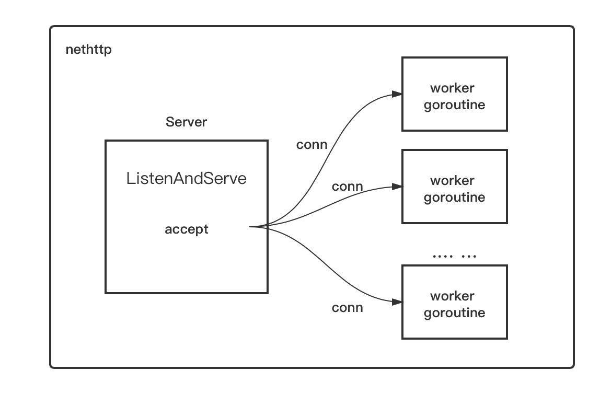
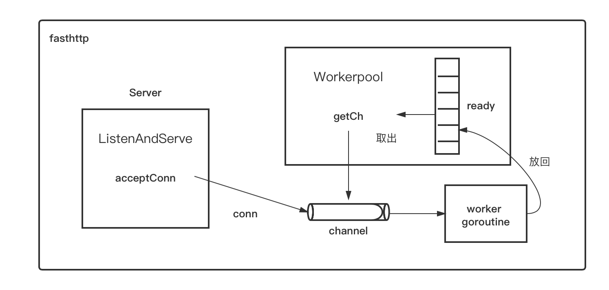

### Fasthttp 设计理念
> 不要分配对象和[]byte缓冲区 - 尽可能多地重用它们
### net/http vs Fasthttp
- net/http 的实现是一个连接新建一个 goroutine; fasthttp是利用一个 worker 复用 goroutine，减轻 runtime 调度 goroutine 的压力
- net/http 解析的请求数据很多放在 map[string]string (http.Header) 或 map[string][]string (http.Request.Form)，有不必要的 []byte 到 string 的转换，是可以规避的
- net/http 解析 HTTP 请求每次生成新的 http.Request 和 http.ResponseWriter; fasthttp解析 HTTP 数据到 fasthttp.RequestCtx ，然后使用 sync.Pool复用结构实例，减少对象的数量
- fasthttp会延迟解析 HTTP 请求中的数据，尤其是 Body 部分。这样节省了很多不直接操作 Body 的情况的消耗

fasthttp的实现与标准库差距较大，所以API的设计完全不同, 因此也不兼容标准库net/http。使用时既需要理解HTTP的处理过程，又需要注意和标准库的差别
### fasthttp Demo

```golang
package main

import (
	"fmt"
	"log"

	"github.com/buaazp/fasthttprouter"
	"github.com/valyala/fasthttp"
)

// index 页
func Index(ctx *fasthttp.RequestCtx) {
	fmt.Fprint(ctx, "Welcome")
}

// 简单路由页
func Hello(ctx *fasthttp.RequestCtx) {
	fmt.Fprintf(ctx, "hello")
}

// 获取GET请求json数据
// 使用 ctx.QueryArgs() 方法
// Peek 取某个键对应的值
func TestGet(ctx *fasthttp.RequestCtx) {
	values := ctx.QueryArgs()
	fmt.Fprint(ctx, string(values.Peek("abc"))) // 不加string返回的byte数组

}

// 获取post的请求json数据
// 这里就有点坑是，查了很多网页说可以用 ctx.PostArgs() 取post的参数，返现不行，返回空
// 后来用 ctx.FormValue() 取表单数据就好了，难道是版本升级的问题？
// ctx.PostBody() 在上传文件的时候比较有用
func TestPost(ctx *fasthttp.RequestCtx) {
	//postValues := ctx.PostArgs()
	//fmt.Fprint(ctx, string(postValues))

	// 获取表单数据
	fmt.Fprint(ctx, string(ctx.FormValue("abc")))

	// 这两行可以获取PostBody数据，在上传数据文件的时候有用
	postBody := ctx.PostBody()
	fmt.Fprint(ctx, string(postBody))
}

func main() {

	// 创建路由
	router := fasthttprouter.New()

	// 不同的路由执行不同的处理函数
	router.GET("/", Index)

	router.GET("/hello", Hello)

	router.GET("/get", TestGet)

	// post方法
	router.POST("/post", TestPost)

	// 启动web服务器，监听 0.0.0.0:8080
	log.Fatal(fasthttp.ListenAndServe(":8080", router.Handler))
}
```

### net/http 与 fasthttp API对比
在fasthttp中使用一个对象来维护请求的上下文:RequestCtx, 它综合了http.Request和http.ResponseWriter的操作，可以更方便的读取和返回数据
```
r.Body -> ctx.PostBody()
r.URL.Path -> ctx.Path()
r.URL -> ctx.URI()
r.Method -> ctx.Method()
r.Header -> ctx.Request.Header
r.Header.Get() -> ctx.Request.Header.Peek()
r.Host -> ctx.Host()
r.Form -> ctx.QueryArgs() + ctx.PostArgs()
r.PostForm -> ctx.PostArgs()
r.FormValue() -> ctx.FormValue()
r.FormFile() -> ctx.FormFile()
r.MultipartForm -> ctx.MultipartForm()
r.RemoteAddr -> ctx.RemoteAddr()
r.RequestURI -> ctx.RequestURI()
r.TLS -> ctx.IsTLS()
r.Cookie() -> ctx.Request.Header.Cookie()
r.Referer() -> ctx.Referer()
r.UserAgent() -> ctx.UserAgent()
w.Header() -> ctx.Response.Header
w.Header().Set() -> ctx.Response.Header.Set()
w.Header().Set("Content-Type") -> ctx.SetContentType()
w.Header().Set("Set-Cookie") -> ctx.Response.Header.SetCookie()
w.Write() -> ctx.Write(), ctx.SetBody(), ctx.SetBodyStream(), ctx.SetBodyStreamWriter()
w.WriteHeader() -> ctx.SetStatusCode()
w.(http.Hijacker).Hijack() -> ctx.Hijack()
http.Error() -> ctx.Error()
http.FileServer() -> fasthttp.FSHandler(), fasthttp.FS
http.ServeFile() -> fasthttp.ServeFile()
http.Redirect() -> ctx.Redirect()
http.NotFound() -> ctx.NotFound()
http.StripPrefix() -> fasthttp.PathRewriteFunc
```

### net/http vs fasthttp 工作原理对比


    <center>图：nethttp工作原理</center>  

`net/http`包作为server端的原理很简单，那就是accept到一个连接(conn)之后，将这个conn甩给一个worker goroutine去处理，后者一直存在，直到该conn的生命周期结束：即连接关闭。


    <center>图：fasthttp工作原理</center>  

`fasthttp`设计了一套机制，目的是尽量复用goroutine，而不是每次都创建新的goroutine。fasthttp的Server accept一个conn之后，会尝试从workerpool中的ready切片中取出一个channel，该channel与某个worker goroutine一一对应。一旦取出channel，就会将accept到的conn写到该channel里，而channel另一端的worker goroutine就会处理该conn上的数据读写。当处理完该conn后，该worker goroutine不会退出，而是会将自己对应的那个channel重新放回workerpool中的ready切片中，等待这下一次被取出。

### fasthttp 遇到的坑


项目背景，各端通过使用fasthttp库做的网关项目请求业务接口
在线上环境中，每次请求高峰导致内存上升， 请求高峰过后内存没有回收（内存泄漏），占用内存不断增加，最后触发报警

    <center>图：内存泄露</center>  
这个问题在本地压测时没有复现，压测过程中内存会上去，压测结束后内存降下来，一切正常。

原因：线上有很多异常请求，导致请求超时，然后使用fasthttp也没有设置`ReadTimeout`, 连接一直占用，内存得不到释放
#### fasthttp Demo 优化
```golang
func main() {
	// 创建路由
	router := fasthttprouter.New()
	// 不同的路由执行不同的处理函数
	router.GET("/", Index)
	router.GET("/hello", Hello)

	// 启动web服务器，监听 0.0.0.0:8080
	server := &fasthttp.Server{
		Handler:      router.Handler,
		ReadTimeout:  30 * time.Second,
		WriteTimeout: 30 * time.Second,
		Concurrency:  256 * 1024,
	}
	log.Fatal(server.ListenAndServe(":8080"))
}

```
fasthttp.Server 还有其他很多参数，Concurrency可以用来限制workerpool中并发处理的goroutine的个数，keep-alive 保持活性连接，ReadBufferSize、WriteBufferSize 读写buffer大小等等

#### fasthttp给出的建议
  
    // If requests take too long and the connection pool gets filled up please
    // 如果请求时间过长且连接池已满，请
    // try setting a ReadTimeout.
    // 尝试设置读取超时。
如果没设请求超时，也没设置Concurrency，就会导致内存泄露

### 参考文献
[fasthttp官网](https://github.com/valyala/fasthttp#fasthttp-best-practices)
[使用fasthttp搭建go的web服务器](https://zhuanlan.zhihu.com/p/52644362)
[高性能web之fasthttp](https://zhuanlan.zhihu.com/p/405314045)
[Go标准库http与fasthttp服务端性能比较](https://tonybai.com/2021/04/25/server-side-performance-nethttp-vs-fasthttp/)
[fasthttp：高性能背后的惨痛代价](https://cloud.tencent.com/developer/news/462918)
[一次 golang fasthttp 踩坑经验](https://mp.weixin.qq.com/s?__biz=MzAxMTA4Njc0OQ==&mid=2651438857&idx=2&sn=1807c7b88265fe4acf74768b7452a52f&chksm=80bb61fbb7cce8ed4ef76c21db363b33806946d581639279981aec4664efee6d0d19b19bc20d&scene=21#wechat_redirect)
