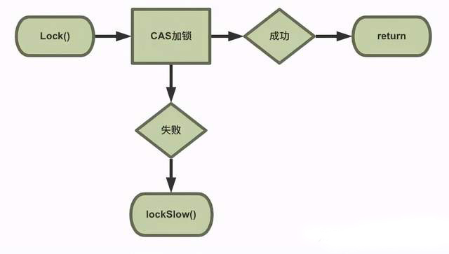
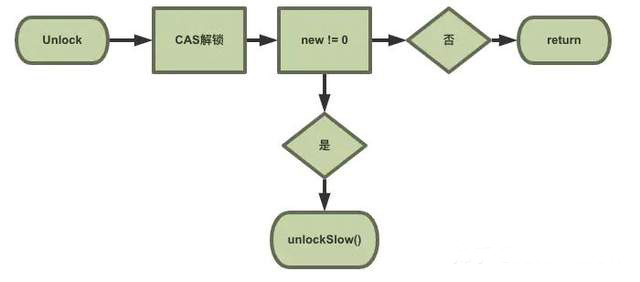

## 简介
>Go语言包中的 sync 包提供了两种锁类型：sync.Mutex 和 sync.RWMutex

Mutex 是最简单的一种锁类型，同时也比较暴力，当一个 goroutine 获得了 Mutex 后，其他 goroutine 就只能乖乖等到这个 goroutine 释放该 Mutex。

RWMutex 相对友好些，是经典的单写多读模型。在读锁占用的情况下，会阻止写，但不阻止读，也就是多个 goroutine 可同时获取读锁（调用 RLock() 方法；而写锁（调用 Lock() 方法）会阻止任何其他 goroutine（无论读和写）进来，整个锁相当于由该 goroutine 独占。从 RWMutex 的实现看，RWMutex 类型其实组合了 Mutex

### sync.Mutex
```golang
// 结构体
type Mutex struct {
	state int32    // 锁的状态
	sema  uint32   
}
// 接口
type Locker interface {
	Lock()
	Unlock()
}
```
state 没上锁的时候是0，上锁了就是1
#### Lock
Lock使用的原子操作 `atomic.CompareAndSwapInt32(&m.state, 0, mutexLocked)`，先比较后交换，如果 state 不是0表示其他协程已经上锁，这个时候会进入 `lockSlow()`，里面有个for死循环，每次循环都会有一个waitTime，直到上锁为止  

#### Unlock
Unlock也是使用原子操作，`atomic.AddInt32(&m.state, -mutexLocked)`，这里直接减1，减完之后state如果不为0表示没有解锁，此时会调用`unlockSlow()`，这里会先判断如果是死锁就抛异常，如果不是死锁也有个for死循环去处理state  


### sync.RWMutex

```golang
type RWMutex struct {
	w           Mutex  // held if there are pending writers
	writerSem   uint32 // semaphore for writers to wait for completing readers
	readerSem   uint32 // semaphore for readers to wait for completing writers
	readerCount int32  // number of pending readers
	readerWait  int32  // number of departing readers
}

// 读锁
func (rw *RWMutex) RLock()
func (rw *RWMutex) RUnlock()
// 写锁
func (rw *RWMutex) Lock()
func (rw *RWMutex) Unlock()
```

RWMutex的`Lock、Unlock` 会调用 Mutex的`Lock、Unlock`，RWMutex的 Lock 会把 readerCount设置成负的rwmutexMaxReaders (十亿)，并且等待所有的读锁释放完  
`RLock`加锁的时候`atomic.AddInt32(&rw.readerCount, 1)`返回值是负数，表示写锁还没有释放，此时会停下来等待写锁释放后再加锁

### 例子
```golang
package main

import (
	"fmt"
	"sync"
)

var (
	// 逻辑中使用的某个变量
	count int
	// 与变量对应的使用互斥锁
	countGuard sync.Mutex
)

func GetCount() int {
	// 锁定
	countGuard.Lock()
	// 在函数退出时解除锁定
	defer countGuard.Unlock()
	return count
}
func SetCount(c int) {
	countGuard.Lock()
	count = c
	countGuard.Unlock()
}
func main() {
	// 可以进行并发安全的设置
	SetCount(1)
	// 可以进行并发安全的获取
	fmt.Println(GetCount())
}
```
对于这两种锁类型，任何一个 Lock() 或 RLock() 均需要保证对应有 Unlock() 或 RUnlock() 调用与之对应，否则可能导致等待该锁的所有 goroutine 处于饥饿状态，甚至可能导致死锁  

### 参考文献
[探究sync.Mutex代码流程](https://zhuanlan.zhihu.com/p/291817455)    
[Go语言互斥锁和读写互斥锁](http://c.biancheng.net/view/107.html)  
