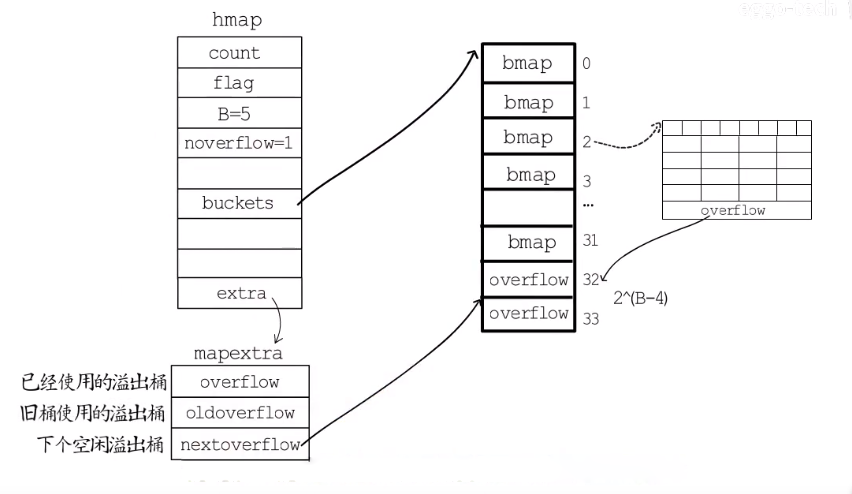

### 先挖坑
- map中 hash冲突是怎么解决的
- map 是怎么存储数据的
- map 什么时候翻倍扩容、什么时候等量扩容
- 为什么map的遍历结果每次都不一样

> 本篇主要通过go hash 的实现，来填上面的坑

### 哈希运算


哈希运算一般就是通过hash函数计算出一个key的数值，然后用这个数值与桶（数组）的个数m`取模`或者`与运算`

go中的hash使用取模法
```
index := hash("author") % array.len
```
### 哈希冲突

常见hash冲突的解决方式：开放地址法和链表法

#### 开放地址法：
在产生碰撞时，一般采用线性探测的方式，从索引的位置向后查找，到达数组末尾时，从数组开始处探测，直到找到一个空位置存储这个key

劣势：`装载因子`，当装载率超过 70% 之后，哈希表的性能就会急剧下降，而一旦装载率达到 100%，整个哈希表就会完全失效


```
装载因子 = 元素数量 ÷ 桶数量
```

#### 拉链法：
一般使用数组加链表的方式，在碰撞的位置使用链表向后延伸，java中碰撞位置的链表达到一定长度会优化成红黑树

go语言中使用拉链法来解决hash碰撞

### 数据结构

> map的源码位于 src/runtime/map.go

```golang
//map结构体是hmap，是hashmap的缩写
type hmap struct {
    count      int            //元素个数，调用len(map)时直接返回
    flags      uint8          //标志map当前状态,正在删除元素、添加元素.....
    B          uint8          //单元(buckets)的对数 log_2 
    noverflow  uint16         //单元(buckets)溢出数量
    hash0      uint32         //哈希种子
    buckets    unsafe.Pointer //指向单元(buckets)数组,大小为2^B，可以为nil
    oldbuckets unsafe.Pointer //旧桶的地址，用于扩容
    nevacute   uintptr        //渐进式扩容进度，小于此buckets迁移完成
    extra      *mapextra      //溢出桶
}

type mapextra struct {
    overflow    *[]*bmap      // 现在的溢出桶
    oldoverflow *[]*bmap      // 旧的溢出桶
    nextOverflow *bmap        // 下一个溢出桶
}

type bmap struct {
    tophash [bucketCnt]uint8  // 存储了键的哈希的高 8 位
    
    //在运行期间bmap会包含以下字段，因为哈希表中可能存储不同类型的键值对，而且 Go 语言也不支持泛型，所以键值对占据的内存空间大小只能在编译时进行推
    topbits  [8]uint8
    keys     [8]keytype
    values   [8]valuetype
    pad      uintptr
    overflow uintptr
}
```

map同样也是数组存储的的，每个数组下标处存储的是一个bucket,每个bucket中可以存储8个kv键值对，当每个bucket存储的kv对到达8个之后，会通过overflow指针指向一个新的bucket，从而形成一个链表



### map扩容规则

#### 翻倍扩容  
go语言中map默认负载因子为6.5，超过以后就会翻倍扩容
```
count/(2^B) > 6.5  
```
所以map中可以最多容纳 6.5 * 2 ^ B 个元素

#### 等量扩容 
负载因子没有超标，noverflow较多时，就会等量扩容。等量扩容就是创建和旧桶同样数目的新桶，然后把原来的键值对迁移到新桶中，减少溢出桶的使用，说白了就是很多键值对被删除的情况下进行rehash

```
noverflow 的阈值
B<=15  时 noverflow >= 2^B
B>15   时 noverflow >= 2^15
```

### 为什么遍历 Go map 是无序的
for range map 汇编
```
    ...
    0x009b 00155 (main.go:11)   LEAQ    type.map[int32]string(SB), AX
    0x00a2 00162 (main.go:11)   PCDATA  $2, $0
    0x00a2 00162 (main.go:11)   MOVQ    AX, (SP)
    0x00a6 00166 (main.go:11)   PCDATA  $2, $2
    0x00a6 00166 (main.go:11)   LEAQ    ""..autotmp_3+24(SP), AX
    0x00ab 00171 (main.go:11)   PCDATA  $2, $0
    0x00ab 00171 (main.go:11)   MOVQ    AX, 8(SP)
    0x00b0 00176 (main.go:11)   PCDATA  $2, $2
    0x00b0 00176 (main.go:11)   LEAQ    ""..autotmp_2+72(SP), AX
    0x00b5 00181 (main.go:11)   PCDATA  $2, $0
    0x00b5 00181 (main.go:11)   MOVQ    AX, 16(SP)
    0x00ba 00186 (main.go:11)   CALL    runtime.mapiterinit(SB)
    0x00bf 00191 (main.go:11)   JMP 207
    0x00c1 00193 (main.go:11)   PCDATA  $2, $2
    0x00c1 00193 (main.go:11)   LEAQ    ""..autotmp_2+72(SP), AX
    0x00c6 00198 (main.go:11)   PCDATA  $2, $0
    0x00c6 00198 (main.go:11)   MOVQ    AX, (SP)
    0x00ca 00202 (main.go:11)   CALL    runtime.mapiternext(SB)
    0x00cf 00207 (main.go:11)   CMPQ    ""..autotmp_2+72(SP), $0
    0x00d5 00213 (main.go:11)   JNE 193
    ...
```
Go map 循环迭代的是两个 runtime 方法
- runtime.mapiterinit
- runtime.mapiternext

```golang
func mapiterinit(t *maptype, h *hmap, it *hiter) {
    ...
    it.t = t
    it.h = h
    it.B = h.B
    it.buckets = h.buckets
    if t.bucket.kind&kindNoPointers != 0 {
        h.createOverflow()
        it.overflow = h.extra.overflow
        it.oldoverflow = h.extra.oldoverflow
    }

    r := uintptr(fastrand())
    if h.B > 31-bucketCntBits {
        r += uintptr(fastrand()) << 31
    }
    it.startBucket = r & bucketMask(h.B)
    it.offset = uint8(r >> h.B & (bucketCnt - 1))
    it.bucket = it.startBucket
    ...

    mapiternext(it)
}
```
在这段代码中，`fastrand()`是个随机数生成方法。用于决定从哪里开始循环迭代。更具体的话就是根据随机数，选择一个桶位置作为起始点进行遍历迭代

因此每次重新 `for range map`，见到的结果都是不一样的。那是因为它的起始位置根本就不固定！

```golang
func mapiternext(it *hiter) {
    ...
    for ; i < bucketCnt; i++ {
        ...
        k := add(unsafe.Pointer(b), dataOffset+uintptr(offi)*uintptr(t.keysize))
        v := add(unsafe.Pointer(b), dataOffset+bucketCnt*uintptr(t.keysize)+uintptr(offi)*uintptr(t.valuesize))
        ...
        if (b.tophash[offi] != evacuatedX && b.tophash[offi] != evacuatedY) ||
            !(t.reflexivekey || alg.equal(k, k)) {
            ...
            it.key = k
            it.value = v
        } else {
            rk, rv := mapaccessK(t, h, k)
            if rk == nil {
                continue // key has been deleted
            }
            it.key = rk
            it.value = rv
        }
        it.bucket = bucket
        if it.bptr != b { 
            it.bptr = b
        }
        it.i = i + 1
        it.checkBucket = checkBucket
        return
    }
    b = b.overflow(t)
    i = 0
    goto next
}
```
mapiternext 进行具体的循环遍历动作。该方法主要涉及如下：

- 从已选定的桶中开始进行遍历，寻找桶中的下一个元素进行处理
- 如果桶已经遍历完，则对溢出桶 overflow buckets 进行遍历处理


### 参考文献

[Map长啥样儿](https://www.bilibili.com/video/BV1Sp4y1U7dJ)  
[哈希表](https://draveness.me/golang/docs/part2-foundation/ch03-datastructure/golang-hashmap/)  
[Map实现原理](https://www.topgoer.com/go%E5%9F%BA%E7%A1%80/Map%E5%AE%9E%E7%8E%B0%E5%8E%9F%E7%90%86.html)  
[Golang map 的底层实现](https://www.jianshu.com/p/aa0d4808cbb8)  
[为什么遍历 Go map 是无序的](https://www.jianshu.com/p/2fd7064bbe44)  