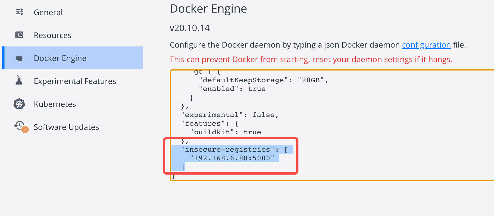

## mac m1构建镜像失败
> ERROR [internal] load metadata
### 原因：
m1 芯片与docker并没有完美兼容
### 解决： 
指定 --platform linux/x86_64
```
docker build --platform linux/x86_64 -t activity:latest .
```

## 镜像拉取失败
> 公司内部镜像拉取失败，需要设置白名单
### docker设置白名单

```
  "insecure-registries": [
    "192.168.x.x:xxxx"
  ]
```

## vscode+docker+python 断点调试
> ImportError: No module named _thread
[stackoverflow](https://stackoverflow.com/questions/71701629/importerror-no-module-named-thread)
### 描述
在使用 vscode + `Remote - Containers` 插件调试 docker 容器中的Python2 项目时，报以上错误
### 解决
VScode 中的 python插件版本需使用 v2022.2.1924087327 


