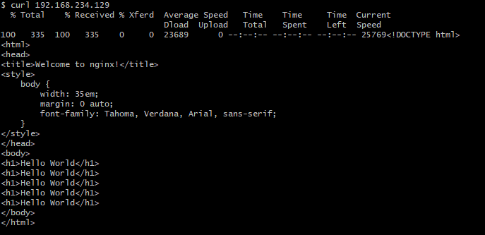
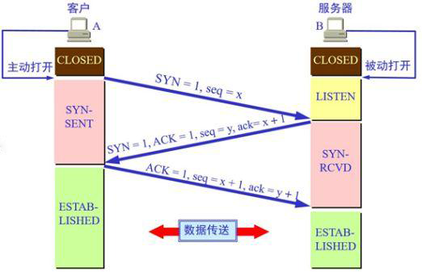

## tcpdump

linux 下一个轻量的抓包工具，跟win下的wireshark一样好用

通过一条命令简单介绍下tcpdump的参数
```
tcpdump tcp -i eth1 -t -s 0 -c 100 and dst port ! 22 and src net 192.168.1.0/24 -w ./target.cap
```
- tcp: ip icmp arp rarp 和 tcp、udp、icmp这些选项等都要放到第一个参数的位置，用来过滤数据报的类型
- -i eth1 : 指定网卡，通过ifconfig命令查看网卡
- -t : 不显示时间戳
- -s 0 : 抓取数据包时默认抓取长度为68字节。加上-S 0 后可以抓到完整的数据包
- -c 100 : 只抓取100个数据包
- dst port ! 22 : 不抓取目标端口是22的数据包
- src net 192.168.1.0/24 : 数据包的源网络地址为192.168.1.0/24
- -w ./target.cap : 保存成cap文件，方便用ethereal(即wireshark)分析

### 使用实例

截获192.168.1.11主机所有的接收和请求数据包
```
tcpdump host 192.168.1.11
```

截获主机210.27.48.1 和主机172.217.161.174 或172.217.161.175的通信
```
tcpdump host 210.27.48.1 and \ (172.217.161.174 or 172.217.161.175 \) 
```

截获主机hostname发送的所有数据
```
tcpdump -i eth0 src host hostname
```

监视所有送到主机hostname的数据包
```
tcpdump -i eth0 dst host hostname
```

获取主机192.168.1.11端口23接收或发出的数据包
```
tcpdump tcp port 23 and host 192.168.1.11
```

### 案例分析

使用tcpdump 抓个http包看下 三次握手和四次挥手

1. 首先在 192.168.234.129 服务器开启监听
```
tcpdump -i eno16777736 port 80
```
2. 在客户端使用curl命令发送http请求
   


3. 因为使用tcpdump 服务端 192.168.234.129 打印出如下完整报文：
```
17:23:41.990650 IP 192.168.234.1.55487 > 192.168.234.129.http: Flags [S], seq 1565178236, win 64240, options [mss 1460,nop,wscale 8,nop,nop,sackOK], length 0
17:23:41.990677 IP 192.168.234.129.http > 192.168.234.1.55487: Flags [S.], seq 3227702871, ack 1565178237, win 29200, options [mss 1460,nop,nop,sackOK,nop,wscale 7], length 0
17:23:41.991845 IP 192.168.234.1.55487 > 192.168.234.129.http: Flags [.], ack 1, win 513, length 0
17:23:41.991989 IP 192.168.234.1.55487 > 192.168.234.129.http: Flags [P.], seq 1:80, ack 1, win 513, length 79: HTTP: GET / HTTP/1.1
17:23:41.992008 IP 192.168.234.129.http > 192.168.234.1.55487: Flags [.], ack 80, win 229, length 0
17:23:41.992434 IP 192.168.234.129.http > 192.168.234.1.55487: Flags [P.], seq 1:238, ack 80, win 229, length 237: HTTP: HTTP/1.1 200 OK
17:23:41.992506 IP 192.168.234.129.http > 192.168.234.1.55487: Flags [P.], seq 238:489, ack 80, win 229, length 251: HTTP
17:23:41.992648 IP 192.168.234.1.55487 > 192.168.234.129.http: Flags [.], ack 489, win 511, length 0
17:23:41.995730 IP 192.168.234.1.55487 > 192.168.234.129.http: Flags [F.], seq 80, ack 489, win 511, length 0
17:23:41.995813 IP 192.168.234.129.http > 192.168.234.1.55487: Flags [F.], seq 489, ack 81, win 229, length 0
17:23:41.996029 IP 192.168.234.1.55487 > 192.168.234.129.http: Flags [.], ack 490, win 511, length 0
```

### TCP报文格式简介


**比较重要的字段有：**

（1）序号（sequence number）：Seq序号，占32位，用来标识从TCP源端向目的端发送的字节流，发起方发送数据时对此进行标记。

（2）确认号（acknowledgement number）：Ack序号，占32位，只有ACK标志位为1时，确认序号字段才有效，Ack=Seq+1。

（3）标志位（Flags）：共6个，即URG、ACK、PSH、RST、SYN、FIN等。具体含义如下：
- URG：紧急指针（urgent pointer）有效。     [U]
- ACK：应答，确认序号有效。                       [.]
- PSH：接收方应该尽快将这个报文交给应用层。   [P]
- RST：重置连接。                           [R] 
- SYN：请求建立连接。                     [S]
- FIN：释放一个连接。                       [F]

<font color=red>注意：</font>不要将确认序号Ack与标志位中的ACK搞混了。确认方Ack=发起方Seq+1，两端配对

**三次握手**


### 报文分析

首先第1 ~ 3行为三次握手

[17:23:41.990650] **第一行报文** `192.168.234.1.55487 > 192.168.234.129.http: Flags [S], seq 1565178236` 客户端192.168.234.1 使用端口55487向服务端 192.168.234.129的80端口(http就是80端口的意思) ，请求建立连接，序列号 1565178236

[17:23:41.990677] **第二行报文** `192.168.234.129.http > 192.168.234.1.55487: Flags [S.], seq 3227702871, ack 1565178237,` 服务端应答客户端的请求并请求与客户端建立连接，此时的seq是服务端随机生成的，ack为客户端的 1565178237

[17:23:41.991845] **第三行报文** `192.168.234.1.55487 > 192.168.234.129.http: Flags [.]` 客户端应答服务端请求建立连接的请求

[17:23:41.991989] ~ [17:23:41.992648] **第四~八行报文** 为客户端与服务端的数据通信
- 第四行客户端请求服务端说 `我需要&*……%￥` Flags [P]
- 第五行服务端回复客户端说 `好的我收到了`  Flags [.]
- 第六、七行服务端回复客户端 `好的给你&*……%￥`  Flags [P.]
- 第八行客户端回复服务端说 `好的我收到了`  Flags [.]

[17:23:41.995730] ~ [17:23:41.996029] **第九~十一行报文** 为<font color=red>四次挥手</font>
- 第九行 `192.168.234.1.55487 > 192.168.234.129.http: Flags [F.], seq 80, ack 489` 客户端跟服务端说`咱们断开连接吧`，序列号seq 80
- 第十行 `192.168.234.129.http > 192.168.234.1.55487: Flags [F.], seq 489, ack 81` 服务端收到断开连接的信号，回复客户端说`行，断开吧`, 应答号ack 81
- 第十一行 客户端收到服务端回复断开连接的信号，回复服务端说 `好的我收到了`

自此客户端与服务端断开tcp连接，完成一次完整的http请求与响应


**四次挥手不应该有四条报文吗，为什么最后只有三条报文？**


> 四次挥手的时候，两个方向的断开是独立的，每个方向发送一个FIN，对方回复一个ACK，但同时，TCP规定ACK可以捎带在其他数据包当中，所以你看到的主动断开连接一方本应收到的ACK，是被对方的FIN包捎带过来的，就变成了三个包。并不是所有的情况下都是这样，典型的一种情况是，主动断开的一方发送FIN之后，被动一方仍然有数据要继续发送，就会先ACK这个FIN，然后继续发送数据（在此过程中主动断开一方仍然会继续ACK这些数据），直到数据发送完毕之后再发送FIN并接收对方的ACK

笔者后来又尝试了几次，最终获得下方报文：

```
20:43:23.452773 IP 192.168.234.129.53455 > 192.168.234.129.http: Flags [S], seq 38053997, win 43690, options [mss 65495,sackOK,TS val 18675681 ecr 0,nop,wscale 7], length 0
16:57:20.894900 IP 192.168.234.129.http > 192.168.234.129.53455: Flags [S.], seq 1773774189, ack 38053998, win 43690, options [mss 65495,sackOK,TS val 18675681 ecr 18675681,nop,wscale 7], length 0
20:43:23.452790 IP 192.168.234.129.53455 > 192.168.234.129.http: Flags [.], ack 1, win 342, options [nop,nop,TS val 18675681 ecr 18675681], length 0
20:43:23.452924 IP 192.168.234.129.53455 > 192.168.234.129.http: Flags [P.], seq 1:175, ack 1, win 342, options [nop,nop,TS val 18675682 ecr 18675681], length 174: HTTP: GET /index.html HTTP/1.1
20:43:23.452940 IP 192.168.234.129.http > 192.168.234.129.53455: Flags [.], ack 175, win 350, options [nop,nop,TS val 18675682 ecr 18675682], length 0
20:43:23.453028 IP 192.168.234.129.http > 192.168.234.129.53455: Flags [P.], seq 1:234, ack 175, win 350, options [nop,nop,TS val 18675682 ecr 18675682], length 233: HTTP: HTTP/1.1 200 OK
20:43:23.453074 IP 192.168.234.129.http > 192.168.234.129.53455: Flags [FP.], seq 234:569, ack 175, win 350, options [nop,nop,TS val 18675682 ecr 18675682], length 335: HTTP
20:43:23.453082 IP 192.168.234.129.53455 > 192.168.234.129.http: Flags [.], ack 234, win 350, options [nop,nop,TS val 18675682 ecr 18675682], length 0
20:43:23.453418 IP 192.168.234.129.53455 > 192.168.234.129.http: Flags [F.], seq 175, ack 570, win 359, options [nop,nop,TS val 18675682 ecr 18675682], length 0
20:43:23.453427 IP 192.168.234.129.http > 192.168.234.129.53455: Flags [.], ack 176, win 350, options [nop,nop,TS val 18675682 ecr 18675682], length 0
```

主动断开方发送的报文标识为 Flags [FP.]，也就是说数据和断开连接请求在同一份报文中发送给对方，被动断开方先响应数据请求发送标识位[.]的报文，再响应断开连接请求发送标识位[F.]的报文，主动断开方收到对方发来的断开请求标识后再做出回应，自此完成四次挥手。

## 参考文献
[来自知乎剑灵的回答](https://www.zhihu.com/question/55890292/answer/146719190)  
[Linux tcpdump命令详解](https://www.cnblogs.com/ggjucheng/archive/2012/01/14/2322659.html) 

